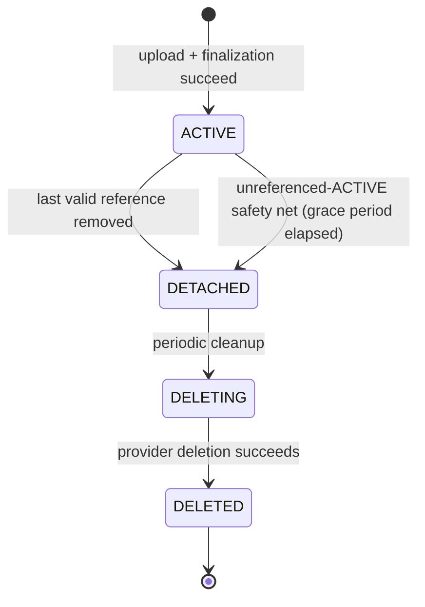

# Asset — Lifecycle

> **Status:** Stable (Implemented)
>
> **Version:** 1.2
>
> **Last Updated:** 2026-09-11

---

# Purpose

This document defines the states an Asset moves through from the moment it is finalized to the moment the underlying storage object is gone, the valid transitions between those states, and the failure paths that make the state machine trustworthy rather than aspirational.

Asset lifecycle begins only once an upload has actually produced an Asset. The upload attempt itself — authorizing it, performing it, waiting on the provider — happens before that point and is not part of Asset lifecycle at all. See [Upload Intent, Not an Asset State](#upload-intent-not-an-asset-state) below and [`upload.md`](./upload.md).

**Implementation:** The four states below (`AssetStatus` in `schema.prisma`) and every transition described in this document are implemented — see `next/src/modules/assets/backend/repository.ts` (the compare-and-set transition methods), `next/src/modules/assets/backend/service.ts` (`AssetService.detachIfUnreferenced`), and `next/src/modules/assets/backend/reconciliation.service.ts` (`AssetReconciliationService`, the periodic-cleanup mechanism). This document previously described a target architecture ahead of the code; it now describes what is actually running. Where a numeric default (a grace period, a batch size) is called out below as a "conservative default," that means exactly that — an intentional, currently-in-effect value, not an unresolved TBD.

---

# The Four States

This is the complete V1 lifecycle. An Asset is created directly in `ACTIVE` — there is no intermediate Asset state for an upload in progress. It intentionally omits provider-deletion retry (the Asset simply remains `DELETING` and cleanup retries — see [Failure Paths](#failure-paths)) so the core lifecycle stays readable.

There are two ways an Asset reaches `DETACHED` from `ACTIVE`: the ordinary path (some entity's reference to it is explicitly cleared or replaced — see [ACTIVE](#active) below) and a safety-net path (periodic reconciliation notices an `ACTIVE` Asset, past a grace period, that no domain relation references at all — see [`AssetReconciliationService.sweepUnreferencedActive`](./security.md#orphan-and-cleanup-architecture)). The safety net exists because attaching a finalized Asset to its target entity is a second, separate request from finalizing the upload itself, and nothing currently guarantees that second request always happens (see the User avatar/cover integration note under [ACTIVE](#active)).

| State | Meaning |
|---|---|
| `ACTIVE` | Upload and finalization completed successfully. Normal, healthy, usable state. This is the state an Asset is created in. |
| `DETACHED` | No longer referenced by any entity. Still exists in storage; nothing about being detached implies the bytes are gone. |
| `DELETING` | The system has decided to physically remove the stored object and that removal is in progress. |
| `DELETED` | The deletion lifecycle has completed. |

---

# Upload Intent, Not an Asset State

Before an Asset exists, there is an **UploadIntent**: the short-lived, application-layer record of an authorized upload attempt (see [`upload.md`](./upload.md)). An UploadIntent is persisted, short-lived, immutable, single-use, and scoped to the actor and purpose that requested it.

`UPLOADING` is *not* an Asset lifecycle state. An in-progress upload belongs entirely to the UploadIntent / upload process. The Asset record itself is only ever created once, at the point an upload succeeds and finalization succeeds — directly in `ACTIVE`. There is no "Asset row that exists but isn't ready yet."

**Implementation:** `UploadIntent` is a first-class Prisma model (`next/src/modules/assets/backend/upload-intent.service.ts`/`upload-intent.repository.ts`). Finalizing an intent (`UploadIntentService.finalize`) re-confirms the upload against the provider directly (never trusting client-reported metadata) and creates the `Asset` row, inside one transaction, directly in `ACTIVE` — matching this section's design exactly.

---

## ACTIVE

The Asset has completed upload and finalization and is the normal, healthy state. It can be attached to any number of the entity relations described in [`overview.md`](./overview.md#relationships-to-domain-entities) (subject to whatever cardinality that relation allows — most are "one active reference," galleries are many).

An Asset is created directly in `ACTIVE`. There is no prior Asset-level state it transitions from.

**Attaching an `ACTIVE` Asset to its target is always a separate step from finalizing it.** Every domain that supports a "logo/cover/avatar" slot (Competition, Project, Portfolio, User) implements its own `setAsset`-shaped method — see `CompetitionAssetService.setAsset`, `ProjectService.setAsset`, and `UserService.setAsset` (`next/src/modules/users/backend/service.ts`) — that validates the Asset (`assertAssetReferenceAllowed`: exists, `ACTIVE`, correct category for the purpose — ownership/`uploadedById` is never checked, since an Asset may be shared) and writes the target entity's `...AssetId` FK. There is no generic "attach" primitive; each domain owns this independently, deliberately, rather than through a shared abstraction that would have to accommodate authorization models that differ per domain (session-based self-scoping for User, membership-based for Project, role-based for Competition).

A finalized Asset that is never attached to anything (the client abandoned the attach step, or a purpose exists with no consumer wired up yet) is not stuck forever: the unreferenced-ACTIVE safety net (above) eventually detaches it once its grace period elapses and `AssetReferenceChecker` confirms nothing references it.

---

## DETACHED

An Asset becomes `DETACHED` when it is no longer referenced by anything that uses it — for example, a user replaces their avatar, or a competition banner is cleared.

`DETACHED` deliberately does **not** mean deleted. The object may still exist in the storage provider. Separating "no longer referenced" from "physically removed" lets the system:

- avoid deleting storage objects synchronously inside the same request that removed a reference (which would tie a user-facing request's latency and failure modes to a third-party API call),
- give a grace window before storage deletion actually happens, if a product decision later wants one,
- reconcile a batch of detached Assets on its own schedule rather than one at a time.

**`DETACHED` is terminal with respect to reuse.** A detached Asset cannot be reattached. If the same underlying file is needed again after detachment, that requires a new upload producing a new Asset — there is no `DETACHED → ACTIVE` transition.

**Implementation:** `AssetRepository.markDetached` performs this transition, scoped to `status: ACTIVE` (compare-and-set — a repeat or concurrent call is a no-op, not an error), and stamps `detachedAt` so periodic cleanup can find "detached long enough ago" rows without scanning every `DETACHED` row. Every domain's `setAsset`-shaped method (see [ACTIVE](#active)) calls `AssetService.detachIfUnreferenced` on the *previous* Asset in the same transaction as the FK swap, guarded so a same-Asset resubmission never redundantly detaches the asset that is still current. This decision is race-safe against a concurrent attach — see [Concurrency](#concurrency).

---

## DELETING

The system has decided to physically remove the stored object, and that removal is in progress. This state exists so that provider deletion — an operation against a third-party API that can fail, time out, or be slow — is represented explicitly rather than assumed to be instantaneous or guaranteed to succeed.

In V1, an Asset only ever enters `DELETING` from `DETACHED`, via periodic cleanup. There is no normal `ACTIVE → DELETING` transition — physical deletion is never initiated while an Asset is still referenced. A future force-delete or moderation-driven removal of a still-referenced Asset is out of scope for V1 and is mentioned here only as a possible future direction, not as a current transition.

**Implementation:** `AssetReconciliationService.sweepDetached` performs `DETACHED → DELETING` for rows past `DETACHED_CLEANUP_GRACE_PERIOD_MS` (a conservative 24-hour default), then attempts physical deletion via the active `StorageProvider`. See [`security.md`](./security.md#orphan-and-cleanup-architecture) for the full reconciliation architecture and [`internal-jobs.md`](../../workflows/internal-jobs.md) for how/when this runs.

---

## DELETED

The Asset has completed its deletion lifecycle: the storage object has been removed (or the deletion has been accepted as final by policy — see below).

**Decision:** `DELETED` rows are retained, not hard-deleted — `AssetRepository` has no method that removes a row from the database; `markDeleted` only changes `status`. This was not an explicit product decision so much as the simplest option that required no additional mechanism; it may be revisited if row growth in the `asset` table becomes an operational concern, but there is currently no purge path and none is planned without a demonstrated need.

---

# Valid Transitions

| Transition | Trigger |
|---|---|
| `[*] → ACTIVE` | An UploadIntent's upload succeeds *and* the result is validated *and* the Asset record is finalized. The Asset is created directly in this state. |
| `ACTIVE → DETACHED` | The last entity reference to the Asset is removed (ordinary path), or periodic reconciliation confirms an `ACTIVE` Asset past its grace period has no reference at all (safety-net path — see `AssetReconciliationService.sweepUnreferencedActive`). |
| `DETACHED → DELETING` | Periodic cleanup (`AssetReconciliationService.sweepDetached`) schedules a detached Asset for physical deletion — see [`internal-jobs.md`](../../workflows/internal-jobs.md) for the invocation mechanism. |
| `DELETING → DELETED` | Provider deletion succeeds. |

No other transitions are valid in V1. In particular:

- There is no `DETACHED → ACTIVE` transition (no reattachment).
- There is no normal `ACTIVE → DELETING` transition (physical deletion only follows detachment).
- There is no `DELETING → DETACHED` transition (see [Failure Paths](#failure-paths) below).

---

# Failure Paths

The state machine only has teeth if every failure mode has a defined destination. This is where the target architecture must be explicit rather than convenient.

| Scenario | Behavior |
|---|---|
| **Provider upload fails, or the UploadIntent is abandoned** (client disappears mid-upload, tab closed, network dies) | No Asset is ever created — an UploadIntent that never resulted in a successful, validated upload has nothing to reconcile at the Asset level, because the Asset lifecycle never begins. `AssetReconciliationService.sweepAbandonedIntents` expires the intent and best-effort cleans up any provider object it may have produced; see [`security.md`](./security.md#orphan-and-cleanup-architecture). |
| **Storage succeeds, but Asset finalization fails** | This is the classic orphan case: a Cloudinary (or future provider) object now exists that Kizunia has no valid, finalized Asset record for — the Asset was never created, because finalization is what creates it. `sweepAbandonedIntents` is exactly what reconciles this once the intent expires. |
| **Finalization succeeds, but the Asset is never attached to a target entity** | Not a classic orphan (a real, valid `Asset` row exists), but the same practical outcome: storage is consumed with nothing pointing at it. `AssetReconciliationService.sweepUnreferencedActive` is the safety net for this case — see [ACTIVE](#active). |
| **Physical deletion from storage fails** | The Asset **remains `DELETING`**. It does not fall back to `DETACHED`. Cleanup/reconciliation retries the physical deletion from `DELETING` until it succeeds; a failed attempt is not treated as evidence the Asset should be reconsidered "merely detached" again. |
| **Can a `DETACHED` Asset be reattached?** | No. Reattachment is not supported. If the same underlying file is needed again, a new upload produces a new Asset. |
| **Can an `ACTIVE` Asset go directly to `DELETING`?** | No, not in V1. Physical deletion is only ever initiated after an Asset has become `DETACHED`. A future force-delete or moderation path for still-referenced Assets is out of scope for this document and would need its own design if pursued. |
| **Can a `DELETED` Asset become `ACTIVE` again?** | No. Once storage deletion has completed, there is nothing to reattach — the underlying object is gone. A new upload producing a new Asset is the only path back to something equivalent. |

---

# Lifecycle Invariants

- An Asset only ever comes into existence in `ACTIVE` — there is no partially-created, not-yet-usable Asset row.
- A `DETACHED`, `DELETING`, or `DELETED` Asset is never a valid target for a *new* attachment. Reuse after detachment always means a new upload, never reattachment of the existing record.
- Storage success and Asset-finalization success are two different facts. The lifecycle must never assume one implies the other — this is the core reason the orphan-reconciliation problem exists (see [`security.md`](./security.md)).
- Detachment (reference removal) and deletion (storage removal) are always separate operations, and physical deletion never runs ahead of detachment.

---

# Concurrency

**A reference count alone is not sufficient to decide `ACTIVE → DETACHED`.** Under PostgreSQL's default `READ COMMITTED` isolation, a `SELECT` (counting references) and a later `UPDATE` (transitioning the Asset) inside the same transaction do not serialize against a concurrent transaction on their own — a legitimate new reference can be written and committed by another transaction in the gap between the count and the transition, producing exactly the outcome the lifecycle must never allow: an Asset that becomes `DETACHED` (and is later physically deleted) while something still legitimately references it.

**The fix: the Asset row itself is the serialization point.** `AssetRepository.lockForUpdate` (`SELECT ... FOR UPDATE`) locks the specific Asset row for the remainder of the caller's transaction. Every write that can create, remove, or replace a reference to an Asset takes this same lock before making its decision:

- `AssetService.detachIfUnreferenced` — the shared, authoritative detach path — locks the Asset, re-verifies it is still `ACTIVE` (a concurrent call may have already transitioned it), and only *then* counts references and transitions it. The count it acts on can never be stale by the time `markDetached` runs, because any transaction that could change that count (see below) is either fully committed before this lock is acquired, or blocked waiting for this transaction to release it.
- `AssetService.prepareAssetAttach` — called by every domain's `setAsset`-shaped write (User, Competition, Project, Portfolio, Portfolio/Project Testimonials, Technology, Competition Suggestion assets) *before* it writes a new `...AssetId` FK — locks the Asset being attached (and, if different, the one it is replacing) and re-validates it is still usable (`validateAssetForPurpose`: exists, `ACTIVE`, correct category) under that lock. The earlier, pre-transaction `assertAssetReferenceAllowed` check every caller also makes is a fast-fail UX convenience only — it reads the Asset unlocked, so by itself it cannot guarantee anything about the moment the transaction actually commits.

Whichever transaction — an attach or a detach — reaches a given Asset row first fully commits (or rolls back) before the other proceeds past its own lock acquisition. This is what makes the two sides of the race safe against each other **regardless of which one happens to run first**:

- If the attacher commits first, the detacher's subsequent recheck sees the new reference and does not detach.
- If the detacher commits first, the attacher's subsequent recheck sees the Asset is no longer `ACTIVE` and rejects the attach (`AssetNotActiveError`) — a legitimate, surfaced failure, never a silent reference to a doomed Asset.

**Lock ordering.** A single `setAsset`-shaped write can touch two Asset rows in one transaction — the Asset being attached and the one it replaces. `prepareAssetAttach` always locks both (when both exist) in a single, fixed ascending-id order, never "new, then old." Without this, a concurrent transaction performing the reverse swap (trading the same two Assets in the opposite direction) could lock the same two rows in the opposite order and deadlock against this one; a single global lock order makes that impossible by construction.

**Reconciliation shares the exact same boundary.** `AssetReconciliationService.sweepUnreferencedActive` does not reimplement "safe detach" — it selects candidates cheaply and optimistically (an unlocked query, `AssetRepository.findActiveBefore`), then calls the same `AssetService.detachIfUnreferenced` for each candidate, in its own short transaction. Candidate discovery does not need to be authoritative: if a candidate picks up a legitimate reference between being selected and its recheck running, `detachIfUnreferenced`'s lock-and-recheck simply leaves it `ACTIVE`. This also keeps locking cheap — no candidate is locked for longer than its own individual recheck-and-transition, never for the duration of a whole batch.

**Shared Assets remain fully supported.** None of this changes the underlying rule: an Asset detaches only when *every* reference `AssetReferenceChecker` knows about is gone, not merely the one reference a particular caller just removed. The lock changes *when* that count is trusted, not what it counts.

---

# User Asset Integration

`User.avatarAssetId`/`User.coverAssetId` are the single authoritative Kizunia-owned reference to a User's avatar/cover Asset — the same relationship shape (and the same `setAsset` pattern) every other domain uses, implemented in `UserService.setAsset` (`next/src/modules/users/backend/service.ts`). There is deliberately no second, independent representation of "the user's picture" introduced by this integration:

- Better Auth's own `user.image` field (a plain string URL, populated by Better Auth itself — e.g. from an OAuth provider's profile picture at sign-in, or by the pre-existing `authClient.updateUser({ image })` call in `user-profile-edit.tsx`) is left entirely untouched by this work. It is not read, written, or synchronized by `UserService`, and it is not treated as authoritative for anything Kizunia-domain. Better Auth has no first-class mechanism for a field that references a row in another application-owned table (confirmed against the official Better Auth documentation — its `additionalFields` mechanism is for scalar, auth-relevant user attributes, e.g. `role`), and `avatarAssetId`/`coverAssetId` are not auth-relevant attributes in the first place: nothing in the authentication/session/OAuth flow needs to know about them. Exposing them through Better Auth would only blur a boundary that is cleaner left alone.
- Wiring the current avatar-editing UI (`next/src/components/user/user-profile-edit.tsx`, which today writes straight to `image` and has no cover-editing UI at all) onto this new, correct backend is explicitly deferred — see [Future Work](#future-work) below. That component is presentational, and this phase intentionally does not touch presentation.

`AssetReferenceChecker` already accounts for `avatarAssetId`/`coverAssetId` (it always did — these were the two columns the checker already enumerated, unused, before this integration existed), so no reference-checking change was required: a User's avatar/cover is treated exactly like every other domain's Asset reference by reconciliation.

---

# Future Work

The next planned phase for this domain is an **Asset Admin UI** — an admin-facing page for browsing Asset records and previewing/applying reconciliation manually, conceptually similar to (but not a direct copy of) the existing Competition Lifecycle admin page's preview/apply pattern. That phase is intentionally not part of this document's implemented scope. What this phase does establish, so that UI can be built cleanly on top of it:

- `AssetReconciliationService`'s sweep methods are already the reusable core the admin UI's "preview candidates" / "apply to selected ids" endpoints would call into — no duplicated reconciliation logic is expected.
- Admin-facing DTOs must not unnecessarily expose provider-sensitive fields (raw Cloudinary `publicId`/`secureUrl`) — see the redaction already applied to `UserAssetDTO` (`next/src/modules/users/types/index.ts`) as the pattern to follow.
- Any admin "apply" operation must re-read and revalidate server-side rather than trusting a prior preview, and must have a bounded id limit per request — the same discipline `CompetitionLifecycleService.apply` already applies.
- Admin authorization is enforced server-side (a dedicated `PlatformAction`, checked at both the page and the API layer), never inferred from the UI alone.
- No persistent reconciliation-history system is planned yet, and no generic job/queue framework is planned — see [`internal-jobs.md`](../../workflows/internal-jobs.md).

---

# Guiding Principle

> **The lifecycle exists so that "does this Asset still exist," "is it usable," and "is it safe to physically delete" are always three separately answerable questions — never one assumption standing in for all three.**
