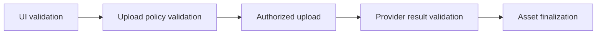
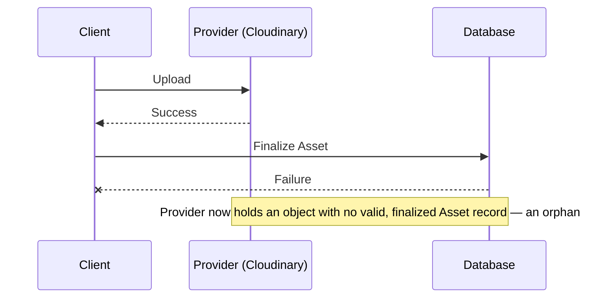

# Asset — Security and Abuse Prevention

> **Status:** Stable (Implemented)
>
> **Version:** 1.1
>
> **Last Updated:** 2026-09-11

---

# Purpose

The Asset system must protect against upload spam, oversized uploads, unauthorized uploads and deletions, malicious files, orphaned storage objects, abuse of signed upload credentials, and provider quota exhaustion. This document defines what that means at each layer, and is explicit about which of these protections exist today and which do not.

The `POST /api/cloudinary-sign` endpoint this document originally audited (an unscoped, entity-blind signing endpoint) no longer exists. It has been replaced end-to-end by the Upload Intent architecture described in [`upload.md`](./upload.md); the sections below describe that replacement, not the endpoint that used to exist.

---

# Authentication

Only authenticated actors should be able to perform protected uploads.

**Implementation:** `AssetController.createUploadIntent`/`finalize` (`next/src/modules/assets/backend/controller.ts`) both call `SessionService.getStrictActor(request)` and reject unauthenticated requests before anything else runs.

---

# Authorization

The actor must be authorized to upload an asset for the *intended purpose and entity* — not merely logged in.

**Implementation:** `UploadIntentService.create` (`next/src/modules/assets/backend/upload-intent.service.ts`) runs `authorizeUploadForPurpose` (`target-authorization.ts`) — which dispatches to the owning domain's own authorizer (`CompetitionAuthorizer.edit`, `ProjectAuthorizer.edit`, etc., or, for a self-scoped purpose like `USER_AVATAR`/`USER_COVER`, simply confirms the actor has an id) — **before** any provider authorization is issued. An actor who is not authorized to edit a given target never receives a working upload authorization for it, closing the gap this section originally described.

---

# Rate Limiting

Upload attempts should be rate limited. Kizunia does not need new infrastructure for this — a fixed-window, Postgres-backed rate limiter already exists (`next/src/lib/rate-limit/`) and is already used elsewhere in the codebase.

**Implementation:** `RateLimitPolicyId.ASSETS_UPLOAD_INTENT` (30/hour, scoped per actor *and* per purpose) and `RateLimitPolicyId.ASSETS_FINALIZE` (60/hour, per actor) are enforced in `AssetController`, both failing closed.

---

# Quotas and Limits

Policies (see [`policies.md`](./policies.md)) should be able to express file size, count, and frequency limits, and potentially aggregate usage limits (e.g. total storage per user). **Decision: TBD** on exact numeric values and on whether aggregate/account-level quotas are needed at all — nothing in the repository or product requirements establishes these today.

---

# Short-Lived, Scoped Authorization

Any upload authorization or signature issued to the client should be short-lived and scoped to the specific upload it was issued for.

**Implementation:** Every `UploadIntent` carries a server-generated `providerCorrelationId` (never client-supplied) and an `expiresAt` 15 minutes out (`UPLOAD_INTENT_TTL_MS`). `CloudinaryStorageProvider.authorizeUpload` signs a fixed `public_id`/`timestamp` pair derived from that correlation id — the client cannot choose its own public id, folder, or resource type; the signature is only valid for the one upload it authorized.

---

# Provider Credentials

Provider secrets must never reach the browser.

**Implementation:** `CLOUDINARY_API_SECRET` is only read server-side, inside `CloudinaryStorageProvider` — the only module permitted to import the `cloudinary` SDK at all. `CLOUDINARY_API_KEY`/`NEXT_PUBLIC_CLOUDINARY_CLOUD_NAME` are exposed to the client, consistent with Cloudinary's own signing model (the API key identifies the account but authorizes nothing without a valid signature).

---

# Client-Side Checks Are UX Only

Client-side file-type/size checks (the `accept` prop on `ReusableImageUploader`, any size check before cropping) exist to give the user immediate feedback. They must never be treated as enforcement — see [`policies.md`](./policies.md#frontend-vs-backend-enforcement).

**Implementation:** `UploadIntentService.create` validates the actor's declared MIME type/size against the resolved `UploadPolicy` before ever issuing a provider authorization, and `finalize` re-validates the **provider-confirmed** result (not the client's declaration) against the same policy before an Asset is ever created — see [File Validation](#file-validation--do-not-trust-client-metadata) below.

---

# File Validation — Do Not Trust Client Metadata

The backend must not trust client-reported filename, browser-supplied MIME type, extension alone, client-provided size, or arbitrary provider parameters supplied by the client. The provider's *actual* result — and, where appropriate, the file's actual content — must be validated.

**Implementation:** `UploadIntentService.finalize` calls `StorageProvider.confirmUpload`, which re-fetches the object directly from Cloudinary's Admin API, and validates the returned (not client-declared) `bytes`/`mimeType` against policy before creating the `Asset` row; a violation triggers best-effort provider cleanup and the finalize call fails — no `Asset` is ever created for a policy-violating upload. The client only ever supplies an `intentId` to `finalize`; it cannot assert any Asset field directly.

For document types such as PDFs (and any future DOCX support), the same principle extends to content safety: **a storage provider successfully accepting and hosting a file does not make that file safe.** Malware/virus scanning for document uploads remains a genuine, currently-unaddressed gap — **no such scanning exists in the repository today**, and none is assumed by this document to exist implicitly. It must be designed and added if/when document uploads that need it are implemented.

---

# Layered Validation

Each layer catches what the previous layer cannot be trusted to have caught. UI validation is convenience; policy validation is the actual authorization boundary; provider result validation confirms the provider did what was authorized, nothing more; finalization is the only point at which an Asset becomes `ACTIVE`. See [`lifecycle.md`](./lifecycle.md) and [`upload.md`](./upload.md).

---

# Orphan and Cleanup Architecture

**Storage success does not imply Asset success.**

This is a **reconciliation problem**, distinct from ordinary error handling: by the time the failure is visible, the side effect that needs to be undone (or accounted for) is sitting in a third-party system, not in Kizunia's own database where a transaction rollback would erase it.

**Implementation:** `AssetReconciliationService` (`next/src/modules/assets/backend/reconciliation.service.ts`) is the reconciliation mechanism, run via `GET /api/v1/internal/assets/reconcile` on a schedule — see [`internal-jobs.md`](../../workflows/internal-jobs.md) for the invocation convention and cadence. There is still no queue or generic background-job framework of any kind in this repository, by design — the service is a plain, callable set of methods with no idea a scheduler exists.

Likewise, `DETACHED → DELETING → provider deletion` (see [`lifecycle.md`](./lifecycle.md)) are separate concerns: detaching a reference does not have to succeed or fail together with the (potentially slow, potentially failing) act of deleting the underlying storage object.

The reconciliation service treats each of the following as a distinct sweep:

- `sweepAbandonedIntents` — an upload that succeeded in storage but never became a finalized `Asset` (the intent expired unconsumed) is found and its provider object, if any, is cleaned up.
- `sweepDetached` — an Asset that became `DETACHED` (past a grace period) is picked up for `DELETING`, then physical deletion.
- `sweepStaleDeleting` — an Asset stuck in `DELETING` after a failed deletion attempt is retried.
- `sweepUnreferencedActive` — a finalized `ACTIVE` Asset that was never attached to anything at all (a distinct case from the ones above: no intent to reconcile, no detachment that already happened — see [`lifecycle.md`](./lifecycle.md#active)) is detected once no domain relation references it, past its own grace period, and moved to `DETACHED` to flow through the ordinary pipeline.

Each sweep is cursor/batch-bounded (a fixed batch size, and a fixed maximum number of batches per invocation) so one scheduled run stays bounded regardless of backlog size; a backlog larger than one run's cap simply drains across multiple scheduled invocations.

`sweepUnreferencedActive`'s candidate discovery is deliberately optimistic — an unlocked query — but the actual `ACTIVE → DETACHED` decision for each candidate goes through the same row-locked, authoritative recheck every normal attach/detach path uses (`AssetService.detachIfUnreferenced`), so a candidate that picks up a legitimate reference concurrently is never incorrectly detached. See [`lifecycle.md#concurrency`](./lifecycle.md#concurrency) for the full mechanism.

---

# Deletion Authorization

Users and other domain actors do not directly delete Asset records, and no one directly transitions an Asset into `DELETING`. What actors authorize is the **domain operation** that adds or removes an Asset *reference* — replacing an avatar, clearing a competition banner, removing a gallery image. That operation is authorized the same way any other write to that entity is (Kizunia's existing authorization system — see `docs/architecture/authorization/`), because it is fundamentally an edit to the entity, not an Asset-level permission.

Once an Asset becomes `DETACHED` as a result of that operation, moving it onward to `DELETING` and physically removing it from storage is performed by trusted cleanup/reconciliation (see [Orphan and Cleanup Architecture](#orphan-and-cleanup-architecture)) — not by the user who happened to trigger the detachment, and not by any other end-user action.

**Implementation:** There is still no user-facing "delete this Asset" operation, and no admin-facing one either — `AssetRepository` has no `delete` method a route could call even if one wanted to expose it. An **Asset Admin UI**, giving admins visibility into Asset records and a manual, re-validated preview/apply trigger for reconciliation (reusing `AssetReconciliationService`, not a new deletion permission), is the next planned phase for this domain — see [`lifecycle.md`](./lifecycle.md#future-work). It is not implemented yet.

---

# Denial of Arbitrary Provider Operations

The Storage Provider Contract (see [`storage.md`](./storage.md)) exposes only the specific operations the Asset system needs (`authorizeUpload`, `confirmUpload`, `deleteObject`, `buildViewUrl`/`buildDownloadUrl`) — never a general-purpose passthrough to the provider's full API. `CloudinaryStorageProvider` is the only module permitted to import the `cloudinary` SDK at all; nothing else in the Asset application layer can ask the provider for anything outside this contract.

Within `confirmUpload`/`deleteObject` specifically, provider errors are classified rather than treated identically: a confirmed "no such object" (`ProviderObjectNotFoundError`) is distinguished from a transient/ambiguous provider failure (`ExternalServiceError`), so reconciliation (`sweepAbandonedIntents`) can tell "there is nothing to clean up" apart from "we could not find out" and never treat the latter as the former.

---

# Observability

At minimum, it should be possible to answer: who initiated an upload, for what purpose, whether it completed, whether it became orphaned, and whether deletion succeeded or failed. **Implementation:** each reconciliation run (`AssetReconciliationService.runAll`) returns a structured `ReconciliationSummary` (per-sweep processed/deleted/detached/deferred counts) as its HTTP response body — visible in Vercel's function logs for the scheduled invocation. There is still no per-upload audit trail beyond that summary and generic error handling/toast notifications on the client; a dedicated audit/history model remains unbuilt and unplanned without a demonstrated need (see [`lifecycle.md`](./lifecycle.md#future-work)).

---

# Guiding Principle

> **The backend is the only party ever trusted to say what was uploaded, by whom, for what purpose, and whether it is safe. Everything the client says about its own upload is a claim to be verified, not a fact to be persisted.**
