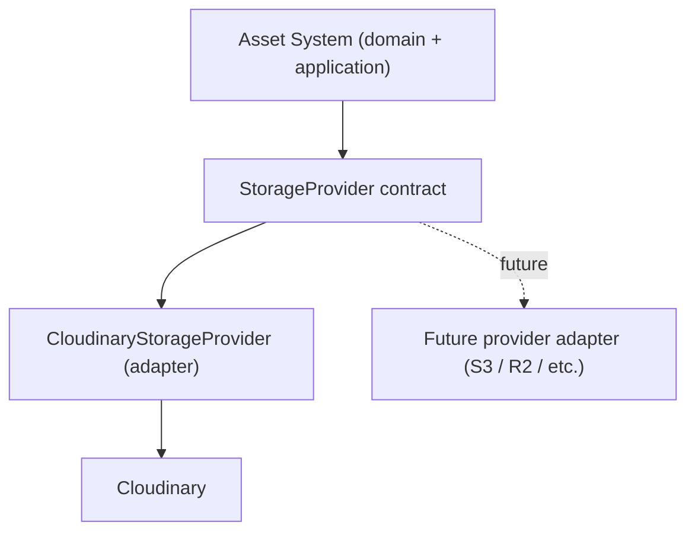

# Asset — Storage Provider Abstraction

> **Status:** Draft (Target Architecture)
>
> **Version:** 1.0
>
> **Last Updated:** 2026-09-05

---

# Purpose

This document defines the boundary between the Asset domain and whatever actually stores the bytes. It is the most important boundary in this entire architecture — see [`overview.md`](./overview.md#the-central-principle-asset--cloudinary) for why.

---

# Domain Concepts vs. Provider Concepts

| Domain concepts (Asset system cares about these) | Provider concepts (must stay behind the adapter) |
|---|---|
| Create/upload authorization for an intended upload | Cloudinary API URLs |
| Performing an upload | Cloudinary signatures |
| Retrieving storage metadata for a completed upload | Cloudinary folders |
| Deleting a stored object | Cloudinary resource-type strings (`image`, `video`, `raw`) |
| Generating access/delivery information, where applicable | Cloudinary-specific response shapes (`public_id`, `secure_url`, `resource_type`, `etag`, …) |
| | Cloudinary environment variables (`CLOUDINARY_API_KEY`, `CLOUDINARY_API_SECRET`, `NEXT_PUBLIC_CLOUDINARY_CLOUD_NAME`, …) |
| | Cloudinary transformation syntax |

The Asset domain/application layer should only ever need the left column. Everything in the right column belongs to the Cloudinary integration and nothing outside it.

---

# Target Shape

A `StorageProvider` contract conceptually exposes operations such as:

- prepare/authorize an upload for a given, already-policy-validated request
- confirm a completed upload and return normalized storage metadata
- delete a stored object
- (where applicable) produce access/delivery information

The exact method signatures are an implementation decision. What matters architecturally is that the Asset domain/application layer calls *this contract*, never Cloudinary's SDK, HTTP API, or response shapes directly.

**Do not assume a migration to S3/R2/or any other provider is planned.** Cloudinary is simply the current provider. The point of the contract is that a future migration would be possible without rewriting the Asset domain/application layer — not that one is scheduled.

---

# Current Implementation

Verified against the repository, Cloudinary-specific concepts currently exist at every layer, including the domain model itself:

| Location | Cloudinary coupling |
|---|---|
| `next/prisma/schema.prisma` — `Asset.provider: AssetProvider` (`CLOUDINARY` is the only enum value) and `Asset.publicId` | The Prisma domain model itself encodes a Cloudinary concept (`publicId` *is* Cloudinary's `public_id`) as a required, unique field. There is no provider-neutral field it sits behind. |
| `next/src/app/api/cloudinary-sign/route.ts` | Directly imports and configures the `cloudinary` SDK, reads `CLOUDINARY_API_KEY` / `CLOUDINARY_API_SECRET` / `NEXT_PUBLIC_CLOUDINARY_CLOUD_NAME`. |
| `next/src/components/cloudinary/imageUploader/useCloudinaryUpload.ts` | Runs entirely in the browser, reads `NEXT_PUBLIC_CLOUDINARY_CLOUD_NAME` / `NEXT_PUBLIC_CLOUDINARY_API_KEY`, hardcodes Cloudinary's `image/upload` REST endpoint, and returns Cloudinary's raw response shape (`CloudinaryUploadResult`) all the way up to the calling component. |
| `next/src/components/cloudinary/imageUploader/reusableImageUploader.tsx` | Consumes `useCloudinaryUpload` directly; the Cloudinary response type leaks into this component's public props (`onUpload(url, info?: CloudinaryUploadResult)`). |
| `next/src/modules/assets/schemas/create-asset.ts`, `dto/create-asset.dto.ts` | Shaped directly around what Cloudinary's upload response contains (`publicId`, `format`, `checksum` from Cloudinary's `etag`, etc.), accepted as-is from the client. |
| `next/src/modules/assets/cloudinary/cloudinary.service.ts` | Exists as a file — presumably an intended integration seam — but is currently **empty**. No server-side Cloudinary Admin API usage (e.g. verifying an upload, deleting an object) exists anywhere in the codebase. |

There is currently **no** `StorageProvider` contract or adapter layer of any kind. Provider concepts are not isolated — they run from the browser, through the API route, into the DTO/schema layer, and into the Prisma model's own field names.

---

# An Open Tension: `publicId` on the Domain Model

`Asset.publicId` is worth calling out specifically, because it sits at the boundary this document is about. As a `@unique` field directly on the `Asset` model, it is both:

- the thing the application actually uses today to identify the Cloudinary object, and
- a Cloudinary-specific concept (`public_id`) baked into what is otherwise meant to be a provider-agnostic domain model.

This document does not resolve that tension by prescribing a schema change — that would be redesigning the domain model, which is out of scope here. It is recorded so that whoever implements the `StorageProvider` contract is aware of it: a provider-neutral domain model would need some provider-neutral way to reference "the thing in storage this Asset row is about" (e.g. an opaque provider reference, or provider-specific identifiers isolated into their own structure rather than sitting on `Asset` as first-class columns). **Decision: TBD.**

---

# What Must Never Leak Into the Asset Domain

- Cloudinary API URLs or SDK types
- Cloudinary signatures or signing parameters
- Cloudinary folder paths
- Cloudinary resource-type strings
- Cloudinary-specific response shapes (`CloudinaryUploadResult` or equivalent)
- Cloudinary environment variables
- Cloudinary transformation syntax

Today, several of these already do leak — most visibly the response type `CloudinaryUploadResult`, which is threaded from the browser's direct Cloudinary call all the way into `ReusableImageUploader`'s public component API. Closing that gap means the uploader infrastructure should return normalized, provider-neutral information to the components that consume it, with Cloudinary's actual response shape stopping at the adapter boundary.

---

# Guiding Principle

> **If a piece of code needs to know it's talking to Cloudinary specifically, it belongs in the adapter. If it just needs an Asset to exist, it belongs everywhere else.**
