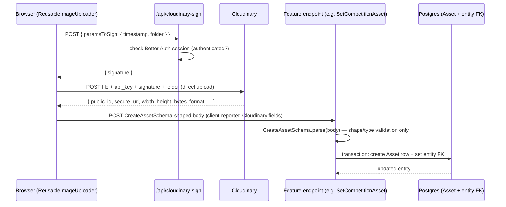
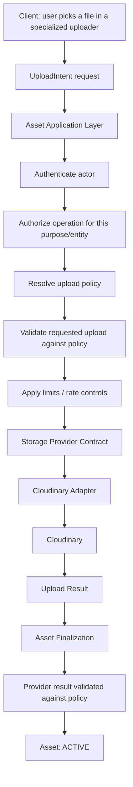

# Asset — Upload Architecture

> **Status:** Draft (Target Architecture)
>
> **Version:** 1.0
>
> **Last Updated:** 2026-09-05

---

# Purpose

This document describes how an upload should flow from a user's browser to a finalized, `ACTIVE` Asset — and contrasts that with how uploads actually flow through the repository today.

Endpoint names below are illustrative of *responsibilities*, not a fixed API contract. The exact routes should follow Kizunia's existing controller/service/repository conventions (see [`folder-structure.md`](../../folder-structure.md)) when implemented.

---

# Current Implementation

This is what the repository does today, verified against `next/src/app/api/cloudinary-sign/route.ts`, `next/src/components/cloudinary/imageUploader/useCloudinaryUpload.ts`, `next/src/components/cloudinary/imageUploader/reusableImageUploader.tsx`, and the `SetCompetitionAssetController` / `CompetitionAssetService` pair:

Key facts about this flow, verified in code:

1. **The signing endpoint authenticates but does not scope the authorization.** `POST /api/cloudinary-sign` checks that a Better Auth session exists, then signs *whatever* `paramsToSign` object the client sent it (`cloudinary.utils.api_sign_request(paramsToSign, KEY)`). It has no idea what the upload is for, which entity it's meant to attach to, or what policy should apply. This is exactly the "please sign whatever Cloudinary parameters I send you" pattern the target architecture (below) exists to move away from.
2. **The client, not the server, decides what gets persisted.** After the direct-to-Cloudinary upload finishes, the browser itself reads Cloudinary's response and constructs the payload it sends to the backend (`CreateAssetSchema`: `publicId`, `secureUrl`, `format`, `mimeType`, `width`, `height`, `bytes`, `checksum`, `originalFilename`). The backend's only check is `CreateAssetSchema.parse(body)` — a Zod schema that validates *shape* (is `bytes` a non-negative int, is `secureUrl` a URL) but never re-verifies any of these values against Cloudinary or against a policy. A client could, in principle, submit a `secureUrl` that was never actually produced by that upload, or misreport `bytes`/`width`/`height`.
3. **Asset creation and entity attachment are already transactional.** `CompetitionAssetService.setAsset` runs `AssetService.create` and `CompetitionRepository.setAsset` inside one `prisma.$transaction`. This part already matches the target's finalization step — the gap is entirely upstream of it, in how the browser talks to Cloudinary directly, unsupervised, before that transaction ever runs.
4. **No purpose/policy concept exists.** The same `CreateAssetSchema` and the same signing endpoint are used regardless of whether the upload is a user avatar, a competition banner, or (in the future) a resume. Nothing in the request declares "this is a `COMPETITION_BANNER` upload" or causes different rules to apply.

This flow works for the images it currently handles, but it is the browser — not the backend — that is the authority on what got uploaded and what its metadata is. That is the central problem the target architecture below addresses.

---

# Target Architecture

## Upload Intent, not "sign anything"

The client never asks the backend to sign arbitrary parameters. Instead it declares an **intent**: *"I am this actor, I want to upload something for this purpose (e.g. `PROJECT_LOGO`), for this entity."*

That declared intent is represented by an **UploadIntent** — the short-lived, application-layer record of one authorized upload attempt. An UploadIntent is:

- **persisted** — it exists as a record the backend can check the upload attempt against, not just an in-memory signature,
- **short-lived** — it expires; it does not remain usable indefinitely,
- **immutable** — once issued, its scope (actor, purpose, policy constraints) does not change,
- **single-use** — it authorizes exactly one upload attempt, not repeated use,
- **actor-scoped** — it is tied to the specific actor who requested it and cannot be used by anyone else.

An UploadIntent represents the upload *before* an Asset exists. It is not an Asset, and "an upload is in progress" is a fact about the UploadIntent, never an Asset lifecycle state (see [`lifecycle.md`](./lifecycle.md#upload-intent-not-an-asset-state)) — no Asset record is created until the upload succeeds and finalization succeeds.

The Asset Application Layer is the one that decides, in order:

1. **Authenticate** — who is making this request? (Better Auth session, as today.)
2. **Authorize** — is this actor allowed to upload for this purpose/entity? (e.g. is this user a maintainer of this project?) This is Kizunia's existing authorization system's job (see `docs/architecture/authorization/`), not a new mechanism.
3. **Resolve the upload policy** for the declared purpose (see [`policies.md`](./policies.md)) — allowed category, MIME types, size limits, count limits.
4. **Validate the requested upload** against that policy — declared file type/size against what the policy allows, *before* any provider call happens.
5. **Apply limits / rate controls** — has this actor exceeded upload attempts for this scope recently? (Kizunia already has a reusable Postgres-backed rate limiter — see [`security.md`](./security.md#rate-limiting).)

Only after all of this does the client receive **authorization scoped to the one upload it asked for** — not a blank signature it can attach arbitrary parameters to.

## Direct Upload, Still

The target architecture does not require routing raw file bytes through the Kizunia backend. A direct-to-provider upload (browser → Cloudinary) can remain the mechanism — that part of today's design is reasonable and avoids proxying large files through the Next.js server. What changes is that the *authorization for that direct upload* is scoped and policy-derived, rather than an open signature over client-supplied parameters.

## Provider Response, Then Finalization

Once the provider (Cloudinary today) reports the upload result, the Asset Application Layer performs **finalization**:

- the provider result is validated (does it match what was authorized — expected folder/resource type/size bounds — rather than being trusted verbatim, as it is today),
- a successful provider upload plus successful finalization creates the Asset record directly in `ACTIVE` (see [`lifecycle.md`](./lifecycle.md)) — there is no intermediate Asset state for an upload in progress; that period belongs to the UploadIntent, not to the Asset,
- the Asset is attached to its owning entity, transactionally — this half of today's implementation (`AssetService.create` + entity FK update inside one `prisma.$transaction`) already matches the target and should be preserved.

## Failure Handling and Orphans

If finalization fails after the provider upload has already succeeded, the result is an orphaned provider object — see [`lifecycle.md`](./lifecycle.md#failure-paths) and [`security.md`](./security.md#orphan-and-cleanup-architecture) for how that must be reconciled. This is not hypothetical: it is already possible in the current implementation, since the browser's Cloudinary upload and the backend's Asset-creation transaction are two separate, unsupervised steps today.

---

# Specialized Uploaders, Shared Infrastructure

The frontend should **not** converge on one universal uploader component with internal branching (`if image... if video... if pdf...`). Kizunia's existing `ReusableImageUploader` already demonstrates why: it has image-specific concerns (cropping via `react-easy-crop`, aspect ratio, zoom, rotation, gallery selection) that have no meaning for a PDF or a video.

The target keeps this shape:

- `ReusableImageUploader` — preview, crop, zoom, rotation, aspect ratio, gallery selection, image-specific validation. **(Exists today.)**
- `DocumentUploader` — deliberately simple: drag-and-drop, browse/select, a loading/uploading state, upload progress where appropriate, a success state, and an error state. It does **not** provide PDF preview, document rendering, page-count extraction/display, a document editor, or any other document-specific UI. **(Does not exist yet — needed for the portfolio resume use case; see [`policies.md`](./policies.md).)**
- `VideoUploader` — video preview, duration/size validation, upload progress. **(Does not exist yet.)**

`DocumentUploader` is intentionally the simplest of the three. A resume upload does not need the platform to render or inspect the document — only to accept it, validate it against policy, and report whether the upload succeeded.

These specialized components should share the same underlying upload infrastructure (the UploadIntent → Asset Application Layer → Storage Provider Contract path above) rather than each reimplementing signing and provider calls independently, the way `useCloudinaryUpload` currently does only for images.

---

# Guiding Principle

> **Authorization should be granted for a specific, intended upload — never for open-ended use of a storage provider's API.**
